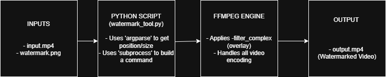

# Studio Production Pipeline Tools - Watermark Prototype

## Personal Motivation

As a software engineering student with a great passion for the entertainment industry, I created this project to bridge the gap between software and studio production. My goal is to learn to build the exact kind of tools that power companies like Netflix Studio and contribute to solving new challenges in the industry.

---

## High-Level System Design

This tool uses Python's `subprocess` module to call the industry-standard FFmpeg media library, applying a filter to overlay an image onto a video file. The entire workflow is managed from a single Python script.

---

## Features

* **Dynamic Watermarking:** Applies a `.png` watermark to any `.mp4` video.
* **Full User Control:** Uses `argparse` to allow command-line control over the watermark's size and position.
* **Lossless Audio:** Copies the audio stream without re-encoding (``-codec:a copy``) for maximum speed and quality.
* **Error Handling:** Includes `try/except` blocks to provide clear error messages if FFmpeg fails or files are missing.

---

## How to Run

### 1. Prerequisites

* Python 3
* FFmpeg (must be installed and added to your system's PATH)

### 2. Installation & Setup

* **Clone the repository:**
`git clone https://github.com/arturocruzsuarez/studio-pipeline-tools.git`
* **Move into the directory:**
`cd studio-pipeline-tools`

### 3. Usage & Examples

The tool is run from your terminal. Your processed video will be saved as `output.mp4`.

* **Basic (default: bottom-right):**
`python watermark_tool.py`

* **Full Example (top-left, resized):**
`python watermark_tool.py -p top-left -w 150 -ht 50`

* **Center Example (centered):**
`python watermark_tool.py -p center`

---

## Available Arguments

* `-p`, `--position`: Position of the watermark.
* **Choices:** `top-left`, `top-right`, `bottom-left`, `bottom-right`, `center`
* **Default:** `bottom-right`
* `-w`, `--width`: Desired width (in pixels) of the watermark.
* `-ht`, `--height`: Desired height (in pixels) of the watermark.
* **(Note: width and height must be used together)**

---

## Technology Stack

* **Core:** Python
* **Media Processing:** FFmpeg
* **Libraries:** argparse, subprocess (Python Standard Library)
* **Development:** Git, GitHub, VS Code
